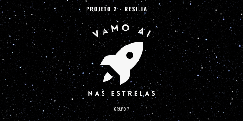

<h1 align="center">⭐️ VAMO AÍ NAS ESTRELAS ⭐️</h1> 

  

***

### Sobre 🧠
* Esse projeto consiste em uma aplicação para acessar informações da [APOD](https://apod.nasa.gov/apod/astropix.html) (Astronomy Picture of the Day), API disponibilizada pela NASA. A aplicação te permite consultar diversos eventos astronômicos com fotos, data de ocorrência e descrição detalhada do evento. 

### Como acessar? 🌌
* Para acessar a aplicação, fique a vontade para clonar esse repositório em sua máquina! Recomendamos fortemente que leia a [documentação](https://github.com/turquetti/Projeto2-VamoAI/wiki/DOCUMENTA%C3%87%C3%83O) da aplicação para maiores informações de bibliotecas usadas e configurações da chave da API e _path_.

### Especificações do projeto 🔗
* Este projeto foi desenvolvido dentro do <b> padrão MVC </b>, utilizando a linguagem <b> Python</b>, onde os dados serão retornados a pessoa usuária em <b>Data Frame</b>, <b>JSON</b> ou <b>CSV</b>.

<h3 align="center"> GRUPO 7️⃣ </h3> 

  <a href="https://github.com/soaresana"> Ana Luiza </a> ⭐️
  <a href="https://github.com/turquetti"> Gabriela Turquetti </a> ⭐️
  <a href="https://github.com/Jeffersonfelixz"> Jefferson Felix </a> ⭐️
  <a href="https://github.com/LudmilaLeal"> Ludmilla Leal </a> ⭐️
  <a href="https://github.com/ramonbrito1995"> Ramon Brito</a>

